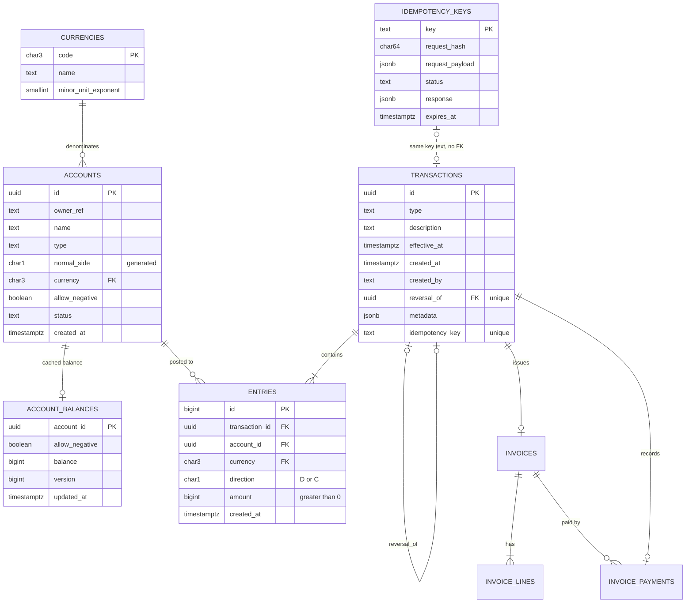

# ER Diagram

```mermaid
erDiagram
    CURRENCIES ||--o{ ACCOUNTS : "denominates"
    ACCOUNTS ||--o| ACCOUNT_BALANCES : "cached balance"
    ACCOUNTS ||--o{ ENTRIES : "posted to"
    TRANSACTIONS ||--|{ ENTRIES : "contains"
    TRANSACTIONS |o--o| TRANSACTIONS : "reversal_of"
    IDEMPOTENCY_KEYS |o..o| TRANSACTIONS : "same key text, no FK"
        INVOICES ||--|{ INVOICE_LINES : "has"
    INVOICES ||--o{ INVOICE_PAYMENTS : "paid by"
    TRANSACTIONS ||--o| INVOICES : "issues"
    TRANSACTIONS ||--o| INVOICE_PAYMENTS : "records"

    CURRENCIES {
        char3 code PK
        text name
        smallint minor_unit_exponent
    }
    ACCOUNTS {
        uuid id PK
        text owner_ref
        text name
        text type
        char1 normal_side "generated"
        char3 currency FK
        boolean allow_negative
        text status
        timestamptz created_at
    }
    TRANSACTIONS {
        uuid id PK
        text type
        text description
        timestamptz effective_at
        timestamptz created_at
        text created_by
        uuid reversal_of FK "unique"
        jsonb metadata
        text idempotency_key "unique"
    }
    ENTRIES {
        bigint id PK
        uuid transaction_id FK
        uuid account_id FK
        char3 currency FK
        char1 direction "D or C"
        bigint amount "greater than 0"
        timestamptz created_at
    }
    ACCOUNT_BALANCES {
        uuid account_id PK
        boolean allow_negative
        bigint balance
        bigint version
        timestamptz updated_at
    }
    IDEMPOTENCY_KEYS {
        text key PK
        char64 request_hash
        jsonb request_payload
        text status
        jsonb response
        timestamptz expires_at
    }
```
